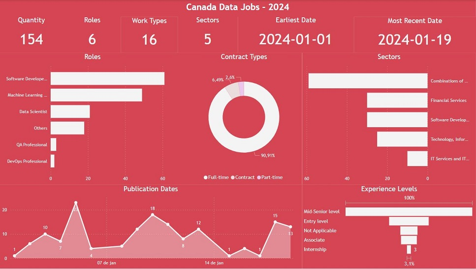

**CANADA DATA JOBS 2024: Data Preparation & Power BI Dashboard Prototype**

### Project Overview

This project demonstrates **end-to-end data engineering and visualization skills** through the cleaning, standardization, and analysis of Canadian LinkedIn job vacancy data for 2024. The focus was on transforming messy, raw job posting data into a clean, analysis-ready dataset and building an interactive **Power BI dashboard prototype** to uncover key labor market trends in the Canadian data and tech sector.

The resulting dashboard provides valuable insights into job distribution, sector demand, role popularity, and market dynamics — empowering recruiters, job seekers, and analysts to make data-driven decisions.

---

### 📊 Dataset

- **Source**: LinkedIn Canada: Data Science Jobs 2024 (Kaggle)
- **Original File**: `linkedin_canada.csv`
- **Time Period**: January – December 2024
- **Final Clean Dataset**: `dataset.csv` (filtered and standardized)

---

### 🔧 Project Components & Files

| Component              | File / Folder                          | Description |
|------------------------|----------------------------------------|-----------|
| **Raw Data**           | `data/linkedin_canada.csv`             | Original LinkedIn job postings |
| **Clean Dataset**      | `data/dataset.csv`                     | Cleaned, filtered & standardized data |
| **Mapping Dictionaries** | `dictionaries/sectors.json` `dictionaries/titles.json` | Standardized sector and job title mappings |
| **Python Pipeline**    | `scripts/preparator.py`                | Data cleaning and transformation script |
| **Power BI Dashboard** | `dashboard/DashboardPrototype-CanadaDataJobs.pbix` | Interactive prototype |
| **Dashboard Visuals**  | `DashboardPrototype-CanadaDataJobs-V2.jpg` | Final dashboard screenshot |

---

### Methodology

#### 1. Data Preparation (Python)
- Developed a robust Python script (`preparator.py`) to automate cleaning and transformation
- Standardized inconsistent **job titles** and **sectors** using JSON mapping dictionaries
- Handled missing values, duplicates, and formatting issues
- Filtered and enriched data for better analytical quality
- Created a reproducible ETL pipeline for future updates

#### 2. Exploratory Analysis & Dashboard Development (Power BI)
- Built an interactive **Power BI prototype** using the cleaned dataset
- Designed clear, insightful visuals to explore:
  - Job distribution by sector and location
  - Most in-demand roles and skills
  - Trends in job postings over time
  - Seniority level and employment type breakdown

---

### 📈 Dashboard Prototype

**Dashboard Features:**
- Clean, professional layout optimized for insights
- Interactive filters (Sector, Location, Seniority, etc.)
- Key performance cards and trend visualizations
- Comparative analysis across job categories

*(Also available: Version 1 screenshot and full `.pbix` file)*

---

### 🚀 Tools & Technologies

- **Programming**: Python (pandas, cleaning & transformation logic)
- **Visualization**: Power BI (DAX, interactive visuals, dashboard design)
- **Data Handling**: JSON mappings, CSV processing, ETL pipeline
- **Source**: LinkedIn data via Kaggle

---

### 🧠 Skills Demonstrated

- Building scalable **data cleaning pipelines** in Python
- Creating reusable **mapping dictionaries** for data standardization
- Transforming raw unstructured job data into high-quality analytical datasets
- Designing clear, interactive **Power BI dashboards** for stakeholder use
- End-to-end project workflow: from raw data to actionable insights

---

### Business Value & Insights

This project delivers a solid foundation for understanding the **Canadian data job market in 2024**, including:
- Which sectors and roles are hiring most aggressively
- Geographic demand hotspots
- Title normalization for consistent reporting
- Ready-to-use pipeline for ongoing monthly updates

The clean dataset and Power BI dashboard prototype can be extended into a full production labor market intelligence tool.

---

**References**  
Kaggle – [LinkedIn Canada: Data Science Jobs 2024](https://www.kaggle.com/datasets/kanchana1990/linkedin-canada-data-science-jobs-2024)

---

**Project Type**: Data Engineering + Business Intelligence Prototype  
**Status**: Complete & Ready for Extension  
**Tools**: Python • Power BI • pandas
